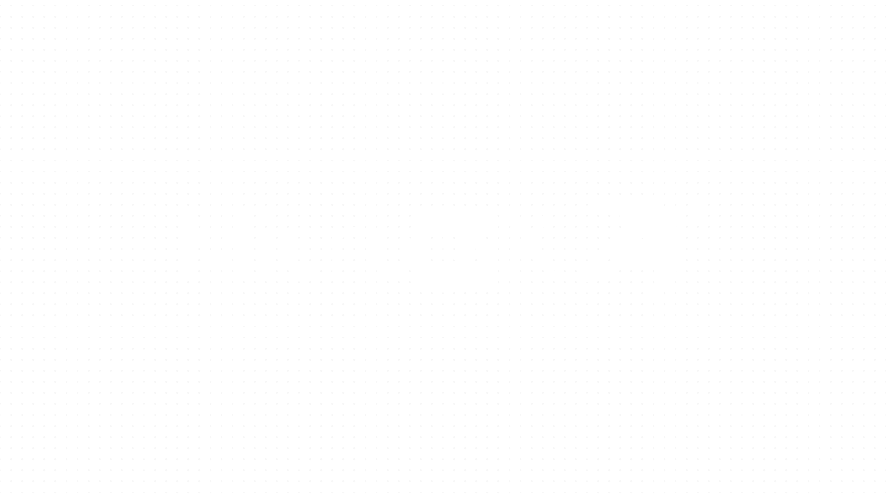

<h2 align="center">
  
</h2>

  

---

# 👨‍💻 MicroDevX

**Software Engineer** | Desktop • Web • Mobile | **Open Source Enthusiast**

- 🖥️ Platforms: Linux & Windows  
- ⚡ Stacks: .NET, Python, Node.js, JS/TS, HTML/CSS, C/C++, ASM, SQL, C#, Markdown, YAML  
- 🎨 UI/UX & Branding: logos, icons, layouts (Adobe Suite)  
- 🌍 Open Source Contributor  

---

## 📌 About Me
I design and build **robust, user-centric software** across desktop, web, and mobile platforms.  
I actively contribute to **open source**, mentor teammates, and craft clean **UX/UI assets**.

---

## 🛠️ Core Skills
- **Languages:** .NET, Python, Node.js, JS, TS, C, C++, ASM, SQL, C#  
- **Frontend/Backend:** HTML, CSS, JavaScript, API design, databases  
- **Tools:** Git, Docker, CI/CD, Adobe Creative Suite (Illustrator, Photoshop, XD)  
- **Platforms:** Linux, Windows  
- **Other:** UI/UX design, branding, accessibility, documentation  

---

## 🚀 Experience Highlights
- ✅ Cross-platform development (desktop/web/mobile)  
- ✅ Significant contributions to OSS projects (PRs, issues, docs)  
- ✅ Design-driven approach: UI/UX, logos, icons  
- ✅ Emphasis on maintainable code, testing, and scalable architecture  

---

## 📊 GitHub Stats

  

---

## 🔧 Skills & Technologies

  
  
  
  
  
  
  
  
  
  
  
  
  
  

---

## 📬 Contact
- 📧 Email: [hi***@outlook.com](mailto:hi%73h%61%6Dw%6Frk%65d%73%6Db23%40%6Futl%6F%6Fk%2Ec%6F%6D)  
- 🐙 GitHub: [MicroDevX](https://github.com/MicroDevX)  

---
